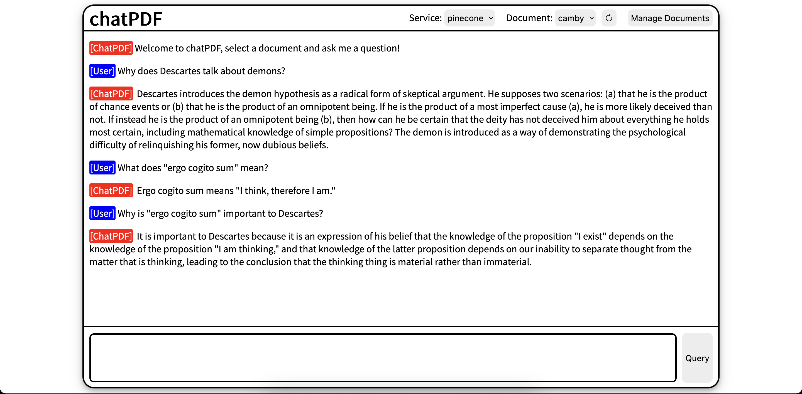

# chatPDF

Chat with a PDF through a Web UI using OpenAI, Pinecone, Chroma, and LangChain



## Requirements

- OpenAI account
- Pinecone account, or locally [run Chroma](https://docs.trychroma.com/api-reference#run-the-backend)

## Setup

1. run `npm i`
2. create `.env` file and add the following:

```
OPEN_API_KEY=<your_key>
PINECONE_API_KEY=<your_key>
PINECONE_API_ENV=<your_env>
```

3. Run the server by calling `npm start`

## Usage

Upload a PDF by clicking the "Manage Documents" button.

To talk with the PDF that you uploaded, go to the home page and select your PDF from the document dropdown box.

If you want to switch from Pinecone to Chroma, make sure you have Chroma running, then select Chroma from the service dropdown box.

## Roadmap

GOAL: locally hosted chat bot to interface with PDF

- BLOCKED: Integrate with GPT4All TS bindings
  - as of 5/22/23 official bindings haven't been made yet
